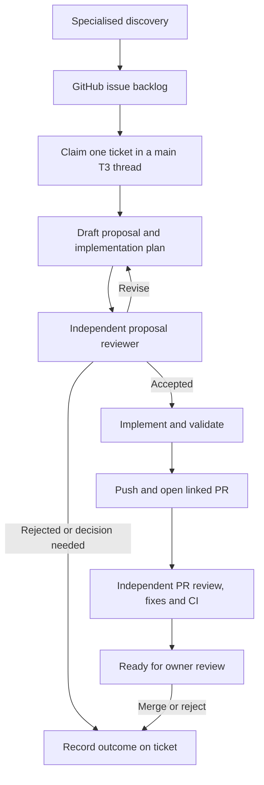

# Agent discovery and ticket delivery

Status: workflow design and initial instruction-only skills. Manual trials come before scheduling. This document does not indicate that a discovery run, delivery run, or overnight batch has completed.

## Purpose

Find worthwhile improvements throughout Askesis, persist them as actionable tickets, and deliver selected tickets through independent proposal review, implementation, and PR review. Each delivery has one main T3 Code thread that owns the outcome. The owner reviews, merges or rejects the resulting PR, and decides when to deploy.

Specialised discovery workflows feed one generic worker. The worker can accept a ticket, select the highest-priority eligible ticket, or filter selection by category. It does not require the owner to identify a module or function.

## Discovery categories

| Category                  | Evidence to seek                                                               | Expected ticket outcome                                                  |
| ------------------------- | ------------------------------------------------------------------------------ | ------------------------------------------------------------------------ |
| Testing                   | Important untested behavior, weak assertions, flaky or brittle tests           | Protect a named behavior or remove a demonstrated source of test failure |
| Interface simplification  | Repeated argument translation, awkward callers, unclear responsibilities       | Reduce caller complexity while preserving required behavior              |
| Code simplification       | Duplicated logic, unnecessary indirection, complex branching, dead code        | A focused simplification with observable compatibility checks            |
| Architecture              | Dependency cycles, boundary violations, tightly coupled responsibilities       | A bounded change tied to a concrete maintenance cost                     |
| Reliability               | Cancellation, recovery, retries, concurrency, resource cleanup and error paths | Establish and protect an explicit failure-handling contract              |
| Performance               | Slow queries, unnecessary rendering or work, memory growth                     | A reproducible baseline and measurable target                            |
| Security and dependencies | Authorization weaknesses, unsafe input handling, dependency problems           | Evidence of impact and an explicit compatibility/rollout decision        |
| Developer experience      | Confusing setup, slow builds, fragile tooling                                  | A reproducible developer problem and improvement criterion               |
| Observability             | Missing diagnostics, misleading logs, hard-to-investigate failures             | Diagnose a named failure without exposing private data                   |
| Product opportunities     | Usability friction, accessibility gaps, missing capabilities                   | A proposal with product assumptions identified for owner review          |

The first three discovery skills are `discover-testing`, `discover-interfaces`, and `discover-reliability`. Other categories can share the same ticket contract without changing the worker. All discovery skills use [the shared discovery procedure](./agent-workflows/discovery-procedure.md).

Discovery reads current code, applicable repository instructions, relevant architecture decisions, existing tickets, and open PRs. Search the repository broadly, then inspect promising areas in depth; report the inspected scope rather than claiming an exhaustive audit. Coverage percentages are evidence, not a quota or the objective. Prefer a few high-value tasks over numerous cosmetic suggestions. Finding no worthwhile new work is a valid result.

## Backlog and ticket contract

Use GitHub Issues in the repository resolved from the current Askesis checkout. Issues hold the task and discussion; labels classify category, priority, and execution state. No Project board or separate task database is required for the initial trial.

Suggested labels:

- Category: `kind:testing`, `kind:interface`, `kind:simplification`, `kind:architecture`, `kind:reliability`, `kind:performance`, `kind:security`, `kind:devex`, `kind:observability`, `kind:product`.
- Priority: `priority:high`, `priority:normal`, `priority:low`.
- State: `state:inbox`, `state:ready`, `state:working`, `state:human-review`, `state:blocked`, `state:rejected`.
- Proposal approval policy: `approval:agent` or `approval:human`.

Create the label vocabulary once during an explicitly authorised backlog setup. A run must not silently change repository settings to compensate for missing labels. If setup is incomplete, retain a local ticket draft and report what is missing. A Project board can later replace state/priority labels with single-select fields.

Use [the ticket template](./agent-workflows/ticket-template.md). A ticket records the problem, commit-scoped evidence, expected benefit, acceptance criteria, exclusions, category, priority rationale, approval policy, dependencies, and discovery provenance. Priority is relative to this backlog, not a severity claim. Honour owner-set priorities; use oldest creation time as the tie-breaker within a priority.

Inspect existing issues, including relevant closed/rejected issues, and open PRs before publishing. Reuse a ticket for the same underlying problem. Do not resurrect rejected work without new evidence; explain the difference when new evidence warrants reconsideration. Additional work discovered during delivery goes into the backlog only when that publication is authorised, rather than expanding the active PR.

Discovery can place bounded, adequately evidenced maintenance in `state:ready`. Ambiguous scope, unresolved product decisions, and incomplete evidence stay in `state:inbox`. A ready ticket is eligible for planning; it does not yet have an accepted implementation plan.

## Worker inputs and claiming

`work-ticket` accepts a ticket URL/number, or selection instructions such as “next ticket” or “next testing ticket”. It accepts an approval policy and optional budgets. An explicit ticket identifies the target but does not override another worker's ownership, dependencies, or a required human decision.

The initial operating contract is **one active delivery worker per repository on this host**. Fixed start-time spacing alone does not enforce this. Before selection or delivery, obtain a host-level reservation using an atomic directory creation and keep it through the terminal handoff. The worker skill specifies the reservation procedure; scheduling later must respect the same reservation or provide equivalent atomic claiming.

Eligible automatic selections are open, ready, unclaimed tickets with no unmet dependencies or existing delivery PR. Exclude blocked, working, rejected, inbox, and human-review tickets. Inspect earlier open PRs for overlapping changes or dependencies; choose independent work when those PRs are unmerged.

Record the claim as a ticket comment with a stable attempt ID, timestamp, owning thread/session reference, branch, worktree, and initial commit. Change state to working and re-read the ticket before editing. Labels and comments provide durable ownership information but are not an atomic lock.

After an interruption, recover the claim, branch, proposal revisions, review history, and PR before doing new work. Resume the same attempt when possible. An interrupted worker leaves both the reservation and ticket claim in place until recovery records a disposition. Do not take over a claim solely because it is old. Verify that its owner is inactive and obtain an explicit recovery instruction if ownership is uncertain. Future multi-host execution needs an atomic central claim mechanism; this design does not claim to provide one.

## Proposal and implementation planning

Revalidate the ticket against the current base before planning. If the problem disappeared, duplicates another task, or cannot justify a change, record that result. Do not manufacture a PR to satisfy a run count.

Use [the proposal template](./agent-workflows/proposal-template.md). One revision contains both the design proposal and implementation steps. Identify the ticket, attempt, revision, inspected base SHA, acceptance criteria, alternatives, affected boundaries, validation, and any decision needed.

Keep authoritative revisions as separate issue comments with stable markers. Drafts can live in a temporary local Markdown file. Never overwrite the accepted revision to make it appear to cover a later design. Post each revision once, using a body file; after a timeout, search comments for its marker before retrying. Comments are engineering-agent updates on behalf of the owner, not human-authored approval.

### Independent proposal review

Use `review-proposal` in an independent child agent or reviewer thread. The reviewer inspects code and relevant documentation, assesses whether the problem is worth solving, and checks the design and validation. The worker cannot review its own proposal as a substitute for independence.

Prefer T3 V2's `delegate_task` when available so the reviewer and result appear under the main thread. Otherwise use the harness's independent subagent support. Send the skill path, exact proposal revision, repository/worktree path, inspected SHA, ticket context, prior objections, and the worker's responses explicitly. Do not assume parent conversation history is inherited. Use a fresh delegated task for each review round, preserving earlier objections in its brief.

The reviewer returns [the proposal review contract](./agent-workflows/proposal-review-template.md): `accepted`, `revise`, `rejected`, or `needs-human`, with a separate technical verdict, identified findings, and evidence. The worker records the actual result and its dispositions on the ticket. Acceptance covers the named revision and base assumptions only. An unaddressed blocking objection prevents implementation; agreement is not obtained by changing reviewers to evade objections.

Default to a maximum of **three proposal review rounds** per attempt, including rounds before a restart. Revisions can continue until acceptance within that budget. At exhaustion, persist the disagreement and mark the ticket blocked. Do not call an incomplete review accepted.

### Approval policy

Agent acceptance is sufficient to start an explicitly authorised, bounded maintenance change that preserves existing product and public API behavior. Tickets can require human acceptance with `approval:human`; conflicting policy resolves to human acceptance.

Human decisions are needed when a proposal changes product behavior, training prescription/calibration semantics, human-confirmation requirements, public interfaces, authorization boundaries, persisted-data contracts or deployed migrations, or requires a substantial architecture/operational change. Prepare and review the complete proposal before requesting that decision. Record the owner's actual acceptance of the exact revision. A reviewer's `accepted` verdict does not override `needs-human` or confer execution permissions.

Askesis's existing architecture remains the basis for proposals: PostgreSQL is the source of truth, Atlas owns migrations, only the API accesses the database, and web/coaching clients use the domain API. Training-plan locking/unlocking requires human confirmation. Consult the current architecture/phase documents rather than changing these contracts as incidental maintenance.

## Implementation and PR delivery

Use a dedicated branch/worktree from the selected base. In T3, establish the thread/worktree binding before implementation; creating a worktree through shell commands alone does not rebind a T3 thread. Reuse an existing correctly bound delivery workspace on resume. Preserve unrelated work.

Implement the accepted plan and map checks to its acceptance criteria. Run focused checks during development and the repository's required checks before readiness. Read current `package.json`, CI, and [local development guidance](./local-development.md) rather than treating command lists as permanently complete. Database/API changes may require disposable database tests and generated-client/type checks. Use current directory-specific instructions for mobile work. Document any pre-existing failure separately; do not weaken checks to obtain a passing result.

Substantive scope or design changes reopen proposal review. Changes needed to address a valid PR finding within the accepted design remain part of delivery. Always retain the unresolved findings ledger across pushes and resumes.

Push the branch and open one PR linked to the ticket and main T3 thread. Use the accepted proposal and validation evidence in its description. The existing local `pr-reviewer` skips draft PRs, so the normal workflow opens a non-draft PR while reserving merge approval for the owner. An existing draft is not made ready solely to bypass reviewer eligibility without owner direction. A draft proposal is independent from a GitHub draft PR.

Use the installed `babysit-pr` skill for independent review, dispositions, fixes, pushes, current-head re-reviews, and CI. Codex is its default reviewer; Claude is selected only when the owner requests it. The new worker has a default **three published PR review rounds** per attempt; explicitly carry that bound into babysitting, overriding its otherwise unbounded loop for this invocation. Respect an explicit user-provided budget instead. A cached review does not consume another round; a new published head review does. If a delegated babysitter is used, transmit these limits and recover its results before handing off.

Readiness requires an open PR, a completed independent review of the current remote head, dispositions for all findings across rounds, passing required CI (or a confirmed absence of required checks), no merge conflict, and evidence for the acceptance criteria. Pending review, unknown CI, a budget limit, or an unresolved blocker cannot be represented as readiness. A run never merges or deploys as part of this workflow.

The handoff includes ticket and PR links, thread reference, proposal revision/acceptance, final and reviewed SHAs, review link, checks, rounds consumed, changes made, and any deferred concerns. Keep the issue open and move it to human-review. On a blocker, persist the state and exact continuation needed, move it to blocked, and release the local lock. Leave the worktree/branch available for recovery.

## Completion, rejection and scheduling

“Ready for owner review” ends the delivery attempt; it is not task completion. Merge completes the ticket, with GitHub's linked-issue closure where applicable. PR closure without merge is not completion: retain the reason and mark the task rejected or blocked pending reconsideration. Reconcile these outcomes when the next run reads the backlog; do not silently requeue rejected work. Settle the T3 thread after the owner decision, keeping its history.

Once manual delivery works, try T3 V2 nightly scheduling before building a separate scheduling service. Version and mobile-client compatibility must be verified at that time. Installing/upgrading T3, setting timers, and changing host sleep settings are separate work.

An overnight batch targets three to five independently reviewable PRs, not a guaranteed count. Start each ticket in its own main thread after the preceding delivery reaches human-review or a recorded blocker, optionally with a short gap. Enforce the single-worker lock and a batch budget. Sleep/offline handling must report missed or delayed work. Fixed alarms can skip while busy; a completion-driven batch controller can instead launch the next worker. Neither is implemented by these skills.

In the morning, the owner reviews and merges chosen PRs, validates the combined result against updated main, then deploys. Avoid stacking the initial batch's PRs or making later tickets depend on unmerged changes.

## Initial skills and layout

The initial package has five skills: three specialised discovery skills (`discover-testing`, `discover-interfaces`, `discover-reliability`), one generic worker (`work-ticket`), and one independent proposal reviewer (`review-proposal`). Their canonical files live in `.codex/skills/NAME/SKILL.md`. Relative per-skill links from `.claude/skills` provide Claude discovery; links from `.agents/skills` provide current Codex repository discovery. One source prevents the two harnesses' instructions drifting.

Invoke with `/discover-testing`, `/discover-interfaces`, `/discover-reliability`, `/work-ticket`, or `/review-proposal` in Claude; use the corresponding `$skill-name` in Codex. Start a session in a checkout containing this branch. The skills leave model choice to the caller and runtime. They do not install credentials, grant tool permissions, or start schedules.

The local host's `babysit-pr` skill and `pr-reviewer` executable are delivery dependencies, available to both Claude and Codex through the owner's existing setup. Discover their installed paths; do not copy or silently rewrite their global configuration. Missing reviewer/delegation capability is a reported blocker to full delivery. A requested planning-only or preview run can still return local drafts without external publication.

## Rollout and validation

1. Review this plan and the five skill definitions.
2. Explicitly set up issue labels in Askesis and verify authenticated issue/PR access and the installed PR reviewer.
3. Run testing discovery manually: inspect across the repo and persist at most three worthwhile, nonduplicate tickets. Publishing to the backlog must be within the requested invocation scope; report-only audits stay local.
4. Start a fresh delivery thread: select one ready ticket, claim it, obtain independent proposal acceptance, implement, validate, publish, and babysit to owner review.
5. Exercise resumption, a proposal disagreement/human decision, a duplicate discovery, and rejection without rediscovery. Confirm the claim, revisions, findings, budgets, and PR remain traceable.
6. Trial interface and reliability discovery, then add other categories using the same ticket contract. Trial a small serial batch, then add scheduling only after the manual lifecycle is reliable.

Accept the workflow when the owner can understand and decide on each PR from its main thread without reconstructing missing work. Failures and decisions must be visible rather than hidden behind a successful dispatch or a claimed “approved” status.

## References

- [GitHub labels](https://docs.github.com/en/issues/using-labels-and-milestones-to-track-work/managing-labels).
- [Linking PRs and issues](https://docs.github.com/en/issues/tracking-your-work-with-issues/using-issues/linking-a-pull-request-to-an-issue).
- [T3 orchestration and independent delegation](https://github.com/pingdotgg/t3code/blob/main/docs/orchestration-v2/orchestrator-mcp-server.md).
- [Codex repository skill discovery](https://developers.openai.com/codex/skills).
- [Claude project skills](https://code.claude.com/docs/en/skills).
