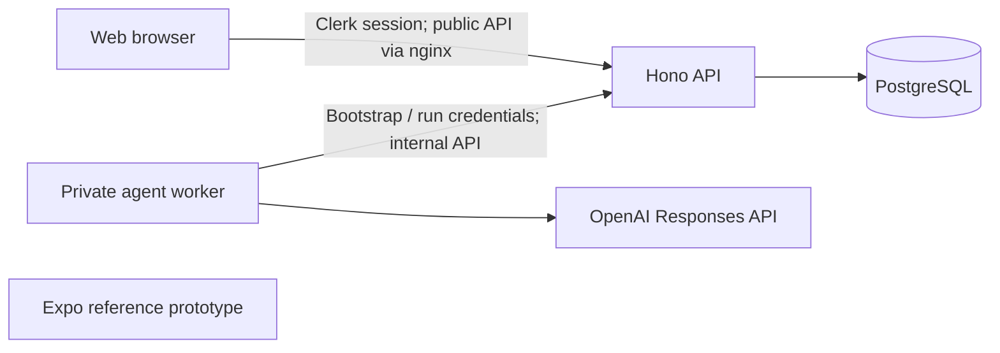

# Repository and service architecture

Verified against the workspace, Compose, Dockerfiles and API/worker/web entry points on 2026-10-06.

## Repository

```text
apps/api       Hono API, authorization, domain services and Kysely persistence
apps/web       React/Vite responsive web app and nginx production proxy
apps/agent     private OpenAI Agents SDK coaching worker
apps/mobile    separate Expo dummy/reference app (npm; excluded from pnpm)
packages/api-client  generated public OpenAPI contract and browser client
 database      Atlas migrations, local synthetic fixtures and SQL invariants
 scripts       generation, checks and disposable integration/smoke harnesses
 docs          current guidance, ADRs and historical delivery records
```

The pnpm workspace contains the web, API, worker and API-client package. Proposed separate contracts/domain/config/UI/observability packages have not been created. Shared domain rules currently live inside the API. Theme values in web/mobile are separate implementations.

## Runtime boundaries



Only the API holds PostgreSQL credentials in application services. Migration, seed, backup and test operator jobs also connect to the database. The worker has provider credentials, an API URL and bootstrap token; it receives no Clerk secret or database URL. Browser credentials cannot authorize internal worker routes.

The browser uses `packages/api-client`, generated from the public Hono/Zod OpenAPI routes. The worker uses a hand-written fetch/Zod client in [api.ts](../../apps/agent/src/api.ts) for `/internal/agent/*`; it does not consume the generated public client. Both reach the same authoritative domain services.

## API

Clerk middleware protects `/api/v1/*`. Internal athlete UUIDs remain separate from provider IDs. Missing identity mappings are lazily provisioned. Alpha access is plan-owner-only; there is no plan membership/sharing model or Clerk webhook synchronization endpoint.

Routes validate payloads and delegate to transactional services. Services enforce lifecycle and run authorization, repositories/aggregate helpers perform reads, and database constraints protect structure/immutability. There is no generic browser CRUD endpoint for each child table or direct SQL tool for the worker.

`/api/health` is a process check; `/api/ready` checks the database migration checkpoint. Swagger/OpenAPI are exposed at `/api/docs` and `/api/openapi.json`. These endpoints are outside human route authentication. `/internal/*` is blocked by the public web nginx proxy; deploy the API privately behind it.

## Worker

The pinned `@openai/agents` SDK owns the model/tool loop. The API owns durable runs, claims, leases, credentials, receipt transactions, cancellation and terminal outcomes. The worker has one execution slot per process; plan/conversation concurrency is enforced by the API across workers.

Runtime configuration currently accepts OpenAI only. Model/reasoning are configurable, with defaults in [worker operations](../operations/phase-5-runtime.md). Provider-neutral deployment abstractions are not a promise of implemented additional providers.

## Web and live data

React Router provides routes. Account-scoped TanStack Query provides server-state caching and mutations. A fetch-based authenticated SSE connection per signed-in tab reads owner-scoped journal notifications and invalidates affected HTTP projections. Visible model text is recovered from durable output reads, not embedded in journal notifications. Reconnection never restarts model execution.

The responsive web app is the development and intended friends-and-family surface. Expo remains a reference; native API/auth integration is deferred. The production web build is static assets served by nginx, not an SSR server.

## Deployment and evolution

Compose includes PostgreSQL, migration, seed, fixture publication, API and web; the worker is an optional `agent` profile. Railway uses PostgreSQL plus private API/worker and a public web proxy. Local seed/publication jobs are excluded from hosted rollout. Hosted service state must be verified independently of repository configuration.

No Redis, external queue, notification broker, global browser stream leader, Terraform or staging topology is implemented. PostgreSQL currently supplies durable work and live replay. Add packages/services when concrete needs justify them, recording significant changes in [ADRs](../adr/README.md).

See [local development](../operations/local-development.md), [Railway rollout](../operations/railway-deployment-plan.md) and [live runtime](../operations/phase-6-runtime.md).
