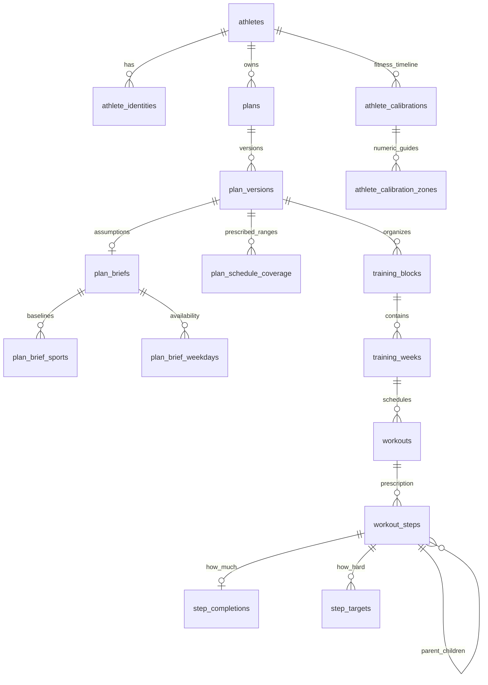

# 3. Explore the data model

[Day checklist](./README.md) · Previous: [TypeScript](./02-typescript.md) · Next: [Frontend](./04-frontend.md)

**75 minutes:** 15 model, 15 connection/identity, 35 SQL and comparisons, 10 checkpoint. Your output is a real owner → plan → version → workout identity map, with one prescription traced to rows.

## The aggregate you need to know · 15 minutes



This is a conceptual relationship map, not a full FK diagram. Read the [data-model guide](../architecture/data-model.md), then the [table inventory](../architecture/storage-architecture.md#current-tables). In particular:

- `athlete_identities` maps a Clerk subject to an internal athlete UUID. Plan ownership uses that internal UUID.
- `plans` is the logical entity: name, owner, organization/activation state, concurrency counter, draft and locked pointers. Dates/description live on `plan_versions`.
- Drafts can change. Lock promotes that same version row into immutable numbered content. Unlock clones its aggregate into a new draft. New physical IDs preserve `lineage_id` for semantic comparison.
- The brief records goal/context, trained sports and baselines, weekday availability and confirmation. Confirmation is checked against a semantic hash, not just a stored timestamp.
- Blocks group weeks and have optional phases; weeks have cutback flags; workouts carry explicit `race_priority` (`A`, `B`, `C` or null).
- A workout has one rooted tree of sequence/repeat/effort steps. A **completion** prescribes how much: distance, duration, repetitions or a condition. It is not evidence of a completed workout. A **target** prescribes effort: zone, pace, watts, RPE, RIR, load or instructions.
- Athlete calibration is an append-only fitness timeline for running pace, cycling power and swimming pace. Strength has no calibration. Zone references in workouts resolve against that timeline on read, using the workout date.
- Coverage ranges distinguish intentional rest inside prescribed days from days not planned yet. An empty workout list alone cannot distinguish them.

These are prescribed plans, not wearable activities or a completed-workout ledger. Views `weekly_plan_summary` and `workout_prescription_totals` derive prescriptions/estimates; neither reports actual training performance.

## Connect and identify your data

Spend 15 minutes on connection and identity discovery.

**Preferred: local seeded database.** Read the ignored root `.env` privately and use this worktree's `DATABASE_URL`/PostgreSQL host port in your database client. Compose's database host is for containers; a desktop client needs localhost and the published port. Do not paste a connection URL into notes. An alternative that avoids copying credentials is:

```bash
docker compose exec postgres psql -U askesis -d askesis
```

**Hosted alternative:** choose the intended Railway project/environment and PostgreSQL service. Use its query console if offered, or copy its externally reachable connection settings privately into your SQL client. A Railway private hostname may only work inside its network; use the service's supplied public connection/TLS settings for a desktop client. Inspect the environment and database name before querying. Do not run the local setup, seed, reset or migration commands against this connection. This course's hosted exercises are reads only.

If a query interface runs each statement in its own session, a `BEGIN` in one panel may not cover the next query. Configure a read-only connection/role or use a single transaction script where supported. For a persistent local SQL session:

```sql
BEGIN READ ONLY;
SET LOCAL statement_timeout = '10s';

SELECT current_database(), current_user;

SELECT a.id AS athlete_id, a.display_name, a.timezone,
       i.provider, i.provider_subject
FROM athletes a
JOIN athlete_identities i ON i.athlete_id = a.id
WHERE i.provider = 'clerk'
ORDER BY a.created_at;
```

Match the Clerk subject for the account signed in to the app, or the known seeded local verification account. On a shared/hosted database, filter to your known Clerk subject instead of listing everyone. The application does not use operator SQL as its authorization boundary.

Record **athlete UUID, logical plan UUID, selected version UUID and workout UUID**. Use your actual IDs in every query below: replace `ATHLETE_UUID`, `PLAN_UUID`, `VERSION_UUID` and `WORKOUT_UUID` inside the quoted literals before executing. These are placeholder labels, not seed constants. Do not assume the fixed Cardiff IDs from older inspection docs belong to your account.

## Exercise: trace your selected plan · 35 minutes

### A. Logical plan versus version · 10 minutes

```sql
SELECT id, display_name, owner_id, state_version,
       current_draft_version_id, current_locked_version_id,
       activated_at, archived_at
FROM plans
WHERE owner_id = 'ATHLETE_UUID'::uuid
ORDER BY created_at;

SELECT id, state, version_number, edit_number,
       start_date, end_date, based_on_version_id,
       supersedes_version_id, content_hash_version, locked_at
FROM plan_versions
WHERE plan_id = 'PLAN_UUID'::uuid
ORDER BY created_at, id;

SELECT sport, current_sessions_status, current_sessions_per_week,
       desired_sessions_per_week, weekly_volume, longest_session
FROM plan_brief_sports
WHERE plan_version_id = 'VERSION_UUID'::uuid
ORDER BY sport;

SELECT start_date, end_date
FROM plan_schedule_coverage
WHERE plan_version_id = 'VERSION_UUID'::uuid
ORDER BY start_date;
```

The examples have two genuine locked revisions. Choose the version the UI is showing, rather than the first row returned. Compare its dates to the app. For the triathlon example, distinguish run/swim metres from cycling seconds in the baselines.

### B. One workout, its tree and its zone · 15 minutes

```sql
SELECT w.id, w.lineage_id, w.title, w.scheduled_date,
       w.primary_discipline, w.race_priority,
       w.estimated_distance_metres, w.estimated_duration_seconds,
       tw.week_number, tw.cutback, b.title AS block_title, b.phase
FROM workouts w
JOIN training_weeks tw ON tw.id = w.week_id
JOIN training_blocks b ON b.id = tw.block_id
WHERE w.plan_version_id = 'VERSION_UUID'::uuid
ORDER BY w.scheduled_date, w.position, w.id;

WITH RECURSIVE tree AS (
  SELECT s.id, s.parent_step_id, s.kind, s.label, s.discipline,
         s.repeat_count, ARRAY[s.position] AS sort_path, 0 AS depth
  FROM workout_steps s
  WHERE s.workout_id = 'WORKOUT_UUID'::uuid
    AND s.parent_step_id IS NULL
  UNION ALL
  SELECT c.id, c.parent_step_id, c.kind, c.label, c.discipline,
         c.repeat_count, t.sort_path || c.position, t.depth + 1
  FROM workout_steps c
  JOIN tree t ON t.id = c.parent_step_id
)
SELECT t.*, c.completion_type, c.numeric_value, c.unit
FROM tree t
LEFT JOIN step_completions c ON c.step_id = t.id
ORDER BY t.sort_path;

SELECT s.label, t.position, t.target_type, t.zone_system, t.zone_key,
       t.minimum_value, t.target_value, t.maximum_value, t.unit
FROM step_targets t
JOIN workout_steps s ON s.id = t.step_id
WHERE s.workout_id = 'WORKOUT_UUID'::uuid
ORDER BY s.position, t.position;

SELECT id, system, method, effective_from, observed_on,
       provenance, calculator_version, retracted_at
FROM athlete_calibrations
WHERE athlete_id = 'ATHLETE_UUID'::uuid
ORDER BY system, effective_from, recorded_at;
```

Choose a run, ride or swim with a zone target. Locate the matching row in `athlete_calibration_zones` using a calibration ID and zone key from your results. Resolution selects the latest nonretracted entry effective on or before the workout day, or the first active entry for earlier days. Read `resolveCalibration` in [performance.service.ts](../../apps/api/src/modules/performance/performance.service.ts), then `resolveZone` in [workout.repository.ts](../../apps/api/src/modules/workouts/workout.repository.ts) to confirm the rule.

Map one visible prescription, such as a repeated effort and recovery, to its parent step, repeat count, completions and targets. Joining every target to every completion can multiply rows; keep targets separate when comparing totals.

### C. Stored versus derived · 10 minutes

```sql
SELECT week_number, workout_count,
       estimated_run_distance_metres, estimated_duration_seconds
FROM weekly_plan_summary
WHERE plan_version_id = 'VERSION_UUID'::uuid
ORDER BY week_number;

SELECT distance_metres, duration_seconds, repetitions
FROM workout_prescription_totals
WHERE workout_id = 'WORKOUT_UUID'::uuid;

ROLLBACK;
```

Compare stored workout estimates to explicit tree totals, considering repeat multipliers. They can measure different things: a time-based effort can have an estimated distance without an explicit distance completion. Do not add both together.

Inspect migrations by search, not by reading them all:

```bash
rg -n 'CREATE TABLE|CREATE OR REPLACE VIEW|CREATE TRIGGER' database/migrations
rg -n 'lineage_id|immutable|locked' database/migrations/20260907120000_plan_versions.sql
rg -n 'athlete_calibrations|effective_from' database/migrations/20261007120000_athlete_performance.sql
```

Calendar dates use PostgreSQL `date` and API `YYYY-MM-DD` strings. Instants use timestamps; [database/client.ts](../../apps/api/src/database/client.ts) installs a date parser to avoid shifting a calendar day through timezone serialization. Stored distance is metres; running pace is seconds/km; swim pace is seconds/100 m; cycling power is watts. API/UI display conversions are a separate layer.

## Checkpoint · 10 minutes

- [ ] Draw your owner → plan → selected version → workout → steps/targets chain using the discovered IDs.
- [ ] Explain why a cloned workout can have a new physical UUID and the same lineage ID.
- [ ] Name the source of the workout title, date, repeat count and displayed zone range.
- [ ] Explain why a locked plan can show new zone guides without its content hash changing: **symbolic targets stay fixed; athlete calibration is resolved on read and is outside semantic plan content.**
- [ ] Explain why “no workouts” does not always mean “rest”: **coverage and plan boundaries provide that meaning.**

Optional later: [expanded SQL recipes](../operations/example-queries.md), [version invariants](../architecture/phase-2-schema-contract.md), [athlete fitness decision](../adr/0005-athlete-owned-performance.md), [multisport decision](../adr/0006-multisport-plans.md). Remember to substitute current account IDs in older recipes.
