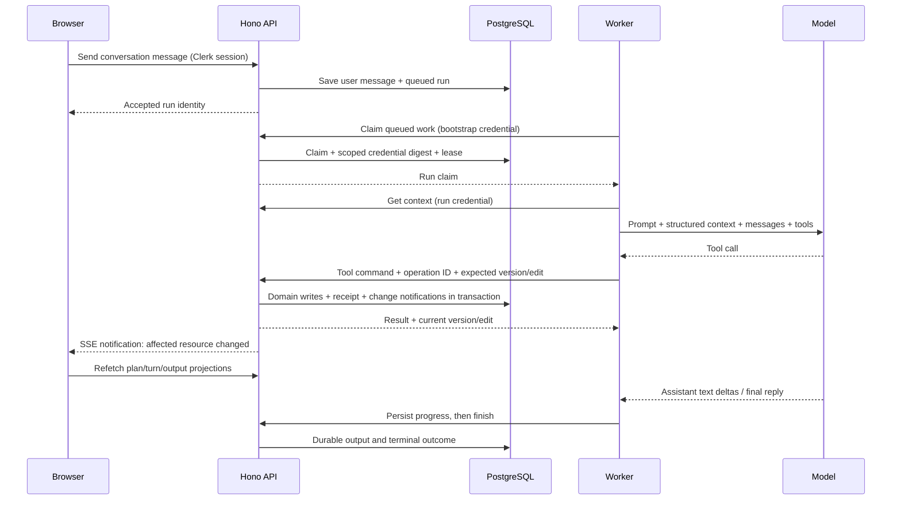

# 6. Follow the coach and live updates

[Day checklist](./README.md) · Previous: [Backend](./05-backend.md) · Next: [Deployment](./07-deployment.md)

**75 minutes:** 15 architecture/prompt, 25 source trace, 25 run/reload exercise, 10 checkpoint. You can complete the core reading without provider credentials; a real model call is an optional extension.

## The model proposes; the API authorizes · 15 minutes

The API persists conversations and runs. A private worker claims a run and uses the OpenAI Agents SDK to orchestrate model responses and tool calls. Tools are HTTP requests to the API; domain writes are not made by the model or worker's direct SQL access.



Read [COACHING_PROMPT](../../apps/agent/src/prompt.ts), concentrating on **Discussion and creation**, **Performance and zones**, **Human control**, and **Context and boundaries**. It defines behavior, but API checks enforce authority. The agent cannot confirm, lock, unlock, restore, discard, archive or activate plans; the allowed tools omit those operations.

The prompt receives current plan/brief/performance context and this conversation's bounded history. It does not search all other chats or the web. It asks for facts, distinguishes unknown from unanswered, supports estimates with provenance and uses deterministic API calculators for zones. It may generate before human brief confirmation; publication still requires human review.

## Source trace · 25 minutes

| Time  | Read these symbols                                                                                                                                            | What to notice                                                                      |
| ----- | ------------------------------------------------------------------------------------------------------------------------------------------------------------- | ----------------------------------------------------------------------------------- |
| 5 min | `send` in [web chat route](../../apps/web/src/routes/chat.tsx); `sendMessage` and `accept` in [chat service](../../apps/api/src/modules/chat/chat.service.ts) | Conversation/message commands, idempotency, execution target and durable queued run |
| 4 min | `Worker.run`/`execute` in [worker.ts](../../apps/agent/src/worker.ts); `claimRun` in [agent service](../../apps/api/src/modules/agent/agent.service.ts)       | Polling, one active slot/process, registration, claim, lease and heartbeat          |
| 5 min | `runContext` in agent service; `SdkRuntime.execute` in [runtime.ts](../../apps/agent/src/runtime.ts)                                                          | Context data, tool construction, model settings, conversation input, `Runner.run`   |
| 4 min | `ToolSchemas`, `descriptions`, `toolDefinitions` in [agent.schemas.ts](../../apps/api/src/modules/agent/agent.schemas.ts)                                     | API-defined schemas become model tool definitions                                   |
| 5 min | `executeTool` in agent service, following `apply_schedule_changes` to [agent.schedule.ts](../../apps/api/src/modules/agent/agent.schedule.ts)                 | Input validation, authorization, receipt, concurrency, atomic batch writes          |
| 2 min | [progress.ts](../../apps/agent/src/progress.ts), `finishRun` in agent service                                                                                 | Durable streamed segments, final reply and terminal outcome                         |

Search helpers:

```bash
rg -n 'sendMessage|function accept|agent_runs' apps/api/src/modules/chat/chat.service.ts
rg -n 'runContext|executeTool|agent_tool_receipts|finishRun' apps/api/src/modules/agent/agent.service.ts
rg -n 'COACHING_PROMPT|new Agent|runner.run|parallelToolCalls|store:' apps/agent/src/runtime.ts
```

### What tools actually exist

| Group      | Tools                                                              | Authority                                                                 |
| ---------- | ------------------------------------------------------------------ | ------------------------------------------------------------------------- |
| Read       | `read_plan_context`, `read_schedule`, `read_performance`           | Authorized current context/schedule/fitness reads                         |
| Plan setup | `create_plan_draft`, `update_plan_brief`                           | Create/bind one plan to a standalone chat; save mutable assumptions/dates |
| Fitness    | `preview_performance`, `record_performance`, `retract_performance` | Deterministic calculation and athlete timeline changes                    |
| Schedule   | `apply_schedule_changes`, `replace_schedule_range`                 | Atomic scoped changes to complete prescription trees                      |
| Validate   | `validate_plan`                                                    | Findings and hashes; never publication                                    |

The public OpenAPI client is for the web. The worker's [AgentApi](../../apps/agent/src/api.ts) is a separate fetch/Zod client for `/internal/agent/*`. Bootstrap authentication permits registration/claim; a scoped run credential authorizes context, heartbeat, tools, progress and finish. The API derives owner/target from the run.

### Durability and concurrency

Think of `agent_runs` as a durable work queue and state machine. PostgreSQL supplies this without a separate Redis/queue service. API-side exclusions prevent simultaneous active work on one conversation/plan. A lease and scoped credential limit a worker's authority after it disappears; the API sweeper fails expired running work instead of replaying an entire model session.

`executeTool` checks allowed name/schema, scoped authorization, expected version/edit and current state. A successful mutation and its `agent_tool_receipts` row commit together. HTTP retries can reuse the same operation ID/input and receive the recorded result. This is not a guarantee of exactly-once model execution: the safeguard concerns accepted tool operations. The runtime serializes tool calls, updates its version/edit from each response and disables parallel model tool calls.

The first schedule batch records the full intended generation horizon. Coverage is asserted for fully prescribed chunks, including rest days. Saved chunks survive interruption; a terminal reply alone does not establish complete horizon coverage.

Model/reasoning/settings live in [config.ts](../../apps/agent/src/config.ts). The current shared prompt marker is `multisport-coach-v3` in worker config/API schemas; it gates compatible worker readiness. If you change the prompt contract later, check both sides. SDK tracing is disabled and response storage is set false in runtime. API-owned conversation/output storage still provides durable app history.

## Exercise: distinguish execution, output and delivery · 25 minutes

### Required local simulated path · 15 minutes

Use the verification account in Coach. With the generated development configuration's `CHAT_EXECUTION_MODE=test`, send `/test slow`. Inspect Network for conversation/message submission and an accepted run. Press Stop, reload and reopen the conversation. Observe persisted user messages, terminal status and any accepted output. This is the simulated API executor in [chat.executor.ts](../../apps/api/src/modules/chat/chat.executor.ts), **not** the worker/model/tool path, and it makes no schedule edits.

Compare `agent_runs` status and timestamps using a read-only client:

```sql
BEGIN READ ONLY;
SELECT id, conversation_id, status, failure_code,
       created_at, started_at, finished_at,
       provider, model, reasoning, prompt_version, tool_count
FROM agent_runs
WHERE owner_id = 'ATHLETE_UUID'::uuid
ORDER BY created_at DESC
LIMIT 10;
ROLLBACK;
```

Replace the owner placeholder. Queued or simulated runs can have null model fields. Do not query credential digests or dump full message/tool payloads just to inspect status.

### Required live-delivery reading · 10 minutes

Read `invalidateNotification` and the fetch to `/api/v1/live/events` in [live.tsx](../../apps/web/src/live.tsx). Then inspect [live routes](../../apps/api/src/modules/live/live.routes.ts) and [RunTurn.tsx](../../apps/web/src/components/chat/RunTurn.tsx).

There are three related data paths:

1. **Domain content:** saved plan/workout/performance rows, refetched over ordinary HTTP.
2. **Visible model output:** saved `agent_run_outputs`, fetched through run turn/output projections. The worker batches deltas through the progress endpoint before the browser presents durable text.
3. **Notifications:** owner-scoped `live_events` journal, delivered as SSE. It names changed resources; it does not carry authoritative plan content or the model text itself.

SSE is a long-lived HTTP response; this code uses authenticated `fetch` and parses frames. Reconnect uses a cursor to replay notifications; expired history can cause a reset/refetch. When disconnected, active queries refresh on a fallback interval. None of these start a new model execution. Account changes tear down the old cache/stream scope.

In Network, locate live bootstrap/events and subsequent turn/output reads. Do not mistake repeated GETs for repeated model calls. Record what survived reload and which source path produced it. If local execution is unavailable, use [worker/runtime tests](../../apps/agent/src/runtime.test.ts) and [chat DB tests](../../apps/api/test/db/chat.test.ts) as a reading fallback; mark interactive observations pending.

### Optional real-coaching extension

This fits the same exercise budget only if a worker is already configured; otherwise save it for a future deep dive. Follow [worker setup](../operations/phase-5-runtime.md#local-setup): API uses agent mode/bootstrap token, worker uses its own ignored `apps/agent/.env` and the matching token/API URL plus provider credentials. `dev:setup` does not copy provider keys. Worker configuration accepts OpenAI; model defaults are in source. Live calls use the configured provider account.

Unlock the local exercise plan through the app and ask for one small, explicit future workout change. Observe a tool receipt and draft edit advance, then reload. Stop a later turn only after a saved change appears and check it remains. Inspect safe run/tool identifiers rather than exporting payloads. `agent_tool_receipts` gives delivery receipts; `agent_tool_changes` gives saved-change attribution. For scripted model/tool examples without a provider, read [SDK runtime tests](../../apps/agent/src/runtime.test.ts) and the [disposable smoke](../../scripts/smoke.sh).

## Checkpoint · 10 minutes

- [ ] Point to the exact prompt, tool schema/descriptions, model runtime and transactional tool execution files.
- [ ] Explain why “please lock this” cannot grant the agent the lock operation.
- [ ] Explain why Stop leaves committed edits: **tool transactions already committed; cancellation stops further execution, not prior transactions.**
- [ ] Explain why reload can recover text and edits: **durable output/domain storage plus fresh reads; SSE is delivery.**
- [ ] Explain why simulated chat proves UI behavior but not real coaching or plan edits.

Optional later: [live runtime and replay](../operations/phase-6-runtime.md), [worker recovery](../operations/phase-5-runtime.md#execution-and-recovery), [coaching worker decision](../adr/0003-coaching-worker.md), [live synchronization decision](../adr/0004-live-synchronization.md).
