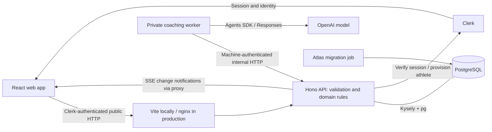

# Understand Askesis in one day

An eight-hour guided tour for a data engineer who helped build Askesis and now wants to navigate it confidently. You already understand SQL, services and package managers; this course explains the TypeScript and frontend ideas as they appear in this repository.

The goal is to find and explain a feature's path through the system. You do not need to understand every function, finish a frontend course or read every migration. At the end, you should be able to point to the code that fetches a workout, the rows behind its prescription, the coach's prompt and tools, and the files and hosted settings that control deployment.

This guide was checked against the repository on **2026-10-09**. It describes code, not a fresh inspection of Railway. Treat source schemas and migrations as the executable contract when older phase documents disagree. Start from named symbols rather than line numbers, which move as the project grows.

## Your day

These blocks total **450 minutes of work plus two 15-minute breaks = eight hours**. Example hours assume a 09:00 start. The times include reading, exercises and checkpoints. Keep a private notes file with the IDs and conclusions you discover; credentials never belong in it.

| Done | Time                 | Chapter                                                       | Result you carry forward                                |
| ---- | -------------------- | ------------------------------------------------------------- | ------------------------------------------------------- |
| [ ]  | 09:00–09:45 · 45 min | [1. Get oriented and run the app](./01-orientation.md)        | A working local app and a service map                   |
| [ ]  | 09:45–10:30 · 45 min | [2. Read this project's TypeScript](./02-typescript.md)       | Read a hook, schema and typed SQL query                 |
| [ ]  | 10:30–11:45 · 75 min | [3. Explore the data model](./03-data-model.md)               | Real plan/version/workout IDs and a row-to-JSON map     |
| [ ]  | 11:45–12:00 · 15 min | Break                                                         | Step away from the screen                               |
| [ ]  | 12:00–13:05 · 65 min | [4. Trace the frontend and its requests](./04-frontend.md)    | One workout traced from route to rendered prescription  |
| [ ]  | 13:05–14:10 · 65 min | [5. Trace backend commands and plan history](./05-backend.md) | Explain authorization, transactions and versioning      |
| [ ]  | 14:10–15:25 · 75 min | [6. Follow the coach and live updates](./06-agent.md)         | Explain a run, a tool write, streaming and cancellation |
| [ ]  | 15:25–15:40 · 15 min | Break                                                         | Step away from the screen                               |
| [ ]  | 15:40–16:30 · 50 min | [7. Understand deployment and validation](./07-deployment.md) | Map local processes to Railway services and CI          |
| [ ]  | 16:30–17:00 · 30 min | [8. Prove you can find things](./08-capstone.md)              | Your own system explanation and next learning questions |

GitHub table checkboxes are visual markers. Copy this working checklist into your notes to tick it off:

- [ ] 1. I can run and identify my local services.
- [ ] 2. I can distinguish TypeScript types from runtime validation.
- [ ] 3. I can find the rows behind a plan and its workout tree.
- [ ] 4. I can trace a browser request and the component that uses it.
- [ ] 5. I can explain owner checks, draft edits and immutable history.
- [ ] 6. I can locate the coach prompt, tools, durable writes and output.
- [ ] 7. I can explain build, deploy, migration and recovery boundaries.
- [ ] 8. I can solve the navigation exercises without a full-repository search.

## How to use it

Each chapter has a short explanation, a bounded reading order, an exercise and a checkpoint with expected answers. Open only the named functions first; large service files are reference material, not a reading assignment. Optional deep dives belong after the day. If setup takes longer than its budget, use the reading fallback and return to setup later; the course does not depend on paid model calls or access to production.

Use an **isolated local worktree and seeded development account** for changes. PostgreSQL inspection can instead use Railway's query interface if available in your project, or your own database client, but keep hosted exploration read-only. The guide requires no deployment, hosted seeding or production edit. [Chapter 3](./03-data-model.md#connect-and-identify-your-data) explains how to select a connection and owner.

By the end you will have four useful artifacts in your notes: a service diagram, a database identity map, a workout trace and a coaching trace. These matter more than memorizing framework names.

## The whole system at a glance

The API owns domain authority. PostgreSQL stores durable state. The browser owns presentation and caches server reads. The worker owns the model/tool loop and calls the API to save changes. The API also provides an owner-scoped live journal so pages know when to refetch.

## Keep this navigation map

| You are looking for…                | Start here                                                                           | Then follow                                                                                                                                          |
| ----------------------------------- | ------------------------------------------------------------------------------------ | ---------------------------------------------------------------------------------------------------------------------------------------------------- |
| A URL or page                       | [web router](../../apps/web/src/router.tsx)                                          | `routes/` page → `components/`                                                                                                                       |
| Plan schedule and workout details   | [PlanView](../../apps/web/src/components/PlanView.tsx)                               | [plan-data hooks](../../apps/web/src/plan-data.ts) → [workout repository](../../apps/api/src/modules/workouts/workout.repository.ts)                 |
| Browser authentication and headers  | [web API wrapper](../../apps/web/src/api.ts)                                         | [API authentication](../../apps/api/src/auth/middleware.ts) → [athlete provisioning](../../apps/api/src/auth/athlete-provisioning.ts)                |
| Request/response fields             | API module's `*.schemas.ts` and `*.routes.ts`                                        | [generated OpenAPI](../../packages/api-client/openapi.json) → [client types](../../packages/api-client/src/schema.ts)                                |
| Lock/unlock/restore                 | [PlanLifecycle](../../apps/web/src/components/PlanLifecycle.tsx)                     | [plan routes](../../apps/api/src/modules/plans/plan.routes.ts) → [plan service](../../apps/api/src/modules/plans/plan.service.ts)                    |
| Tables, constraints, triggers       | [migrations](../../database/migrations/)                                             | [generated DB types](../../apps/api/src/database/generated.ts) and [data-model guide](../architecture/data-model.md)                                 |
| Paces, watts and swim zones         | [performance service](../../apps/api/src/modules/performance/performance.service.ts) | Sport calculators in that directory → workout zone resolution                                                                                        |
| Why the coach behaves that way      | [prompt](../../apps/agent/src/prompt.ts)                                             | [tool schemas/descriptions](../../apps/api/src/modules/agent/agent.schemas.ts) → [tool execution](../../apps/api/src/modules/agent/agent.service.ts) |
| Model choice and execution          | [worker config](../../apps/agent/src/config.ts)                                      | [runtime](../../apps/agent/src/runtime.ts) → [worker](../../apps/agent/src/worker.ts)                                                                |
| A reply or edit surviving reload    | [web live provider](../../apps/web/src/live.tsx)                                     | [live service](../../apps/api/src/modules/live/live.service.ts) → [RunTurn](../../apps/web/src/components/chat/RunTurn.tsx)                          |
| Theme, units or browser preferences | [settings](../../apps/web/src/settings.tsx)                                          | [palette](../../apps/web/src/theme/palette.ts), `styles/`, `lib/format.ts`                                                                           |
| Sample data construction            | [example blueprints](../../apps/api/src/examples/blueprint.ts)                       | [writer](../../apps/api/src/examples/writer.ts) → [seed orchestration](../../apps/api/src/examples/seed.ts)                                          |
| CI or startup failure               | [CI workflow](../../.github/workflows/ci.yml)                                        | [root scripts](../../package.json), service Dockerfile/config, [operations](../operations/README.md)                                                 |
| Historical intent or a decision     | [ADRs](../adr/README.md)                                                             | Current architecture/product docs; archive for past delivery evidence                                                                                |

Return to the [documentation index](../README.md). Begin [chapter 1](./01-orientation.md).
