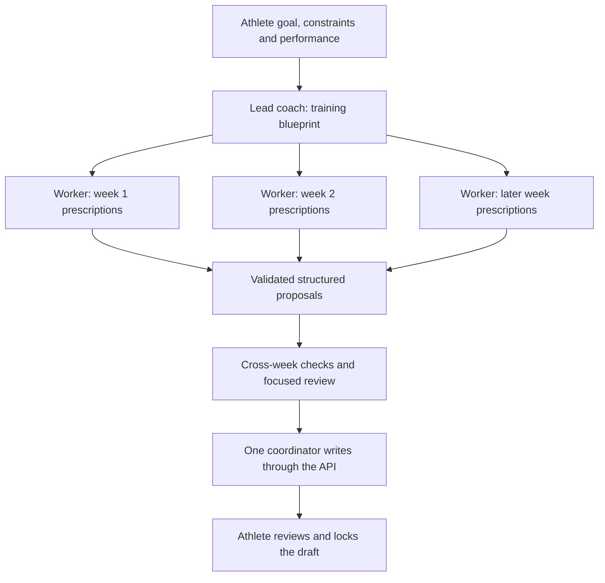

# Coaching agent feature exploration

Research date: 2026-10-09. Status: exploratory ideas, not an implementation plan or roadmap commitment.

## Recommendation

The strongest opportunities are richer input, persistent coaching context, better control during long work, and a training feedback loop. Parallel specialist agents are worth investigating as a focused generation optimization. They should serve a coherent coaching experience, with one lead coach responsible for the strategy and final result.

My first product slice would combine image/PDF attachments, references to specific workouts, and structured clarification cards. My first runtime experiment would compare the current generator with a lead coach plus cheaper workout generators and with deterministic workout-template expansion. Persistent preferences and structured training feedback would follow; together they support meaningful weekly reviews.

## Idea tracking

The feature ideas below are captured as GitHub issues with `enhancement`, `state:inbox` and `approval:human`. Priorities are unassigned. Issues are authoritative for scope, decisions, dependencies and delivery state; this document retains the research and architectural rationale. Inbox issues need bounded acceptance criteria and validation before promotion to ready.

| Idea                                                                      | Issue                                                     |
| ------------------------------------------------------------------------- | --------------------------------------------------------- |
| Share images and PDFs with the coaching agent                             | [#37](https://github.com/benjamingriff/askesis/issues/37) |
| Reference workouts and weeks directly in coaching messages                | [#38](https://github.com/benjamingriff/askesis/issues/38) |
| Answer coaching clarifications through structured question cards          | [#39](https://github.com/benjamingriff/askesis/issues/39) |
| Queue editable coaching follow-ups while a run is active                  | [#40](https://github.com/benjamingriff/askesis/issues/40) |
| Steer an active coaching run at a safe execution boundary                 | [#41](https://github.com/benjamingriff/askesis/issues/41) |
| Evaluate cheaper parallel specialist agents for workout generation        | [#42](https://github.com/benjamingriff/askesis/issues/42) |
| Review generated plans with deterministic checks and a focused specialist | [#43](https://github.com/benjamingriff/askesis/issues/43) |
| Remember editable athlete coaching preferences across conversations       | [#44](https://github.com/benjamingriff/askesis/issues/44) |
| Record workout completion and perceived-effort feedback for coaching      | [#45](https://github.com/benjamingriff/askesis/issues/45) |
| Deliver evidence-based weekly coaching reviews with optional recurrence   | [#46](https://github.com/benjamingriff/askesis/issues/46) |
| Compare alternative training schedules before applying one                | [#47](https://github.com/benjamingriff/askesis/issues/47) |
| Restore a plan draft to before a coaching turn                            | [#48](https://github.com/benjamingriff/askesis/issues/48) |
| Show typed visual and interactive coaching cards in chat                  | [#49](https://github.com/benjamingriff/askesis/issues/49) |
| Dictate editable coaching messages and post-workout notes on mobile web   | [#50](https://github.com/benjamingriff/askesis/issues/50) |
| Configure versioned coaching methodologies and communication preferences  | [#51](https://github.com/benjamingriff/askesis/issues/51) |
| Offer a discussion mode with no plan mutation tools                       | [#52](https://github.com/benjamingriff/askesis/issues/52) |
| Route coaching tasks to appropriate model and reasoning settings          | [#53](https://github.com/benjamingriff/askesis/issues/53) |
| Connect activity data to prescribed workouts for coaching                 | [#54](https://github.com/benjamingriff/askesis/issues/54) |
| Look up event information and coaching evidence with source links         | [#55](https://github.com/benjamingriff/askesis/issues/55) |
| Account for coaching run and specialist-task costs                        | [#56](https://github.com/benjamingriff/askesis/issues/56) |

Grouped sections below may map to several independently scoped issues. The parallel-generation issue begins with a comparison of architectures; it does not assume that sub-agents improve latency or cost.

## What was inspected

Askesis source: the web composer/transcript/run activity and change cards; the worker prompt, runtime, configuration and execution loop; API conversation acceptance, context assembly, tools, authorization and schedule writes; current product guidance and post-alpha backlog.

External research: T3 Code public source and documentation at revision `43f8a8de17a7ac1baa7a3cf36d681856de2d8add`; official Cursor, Claude, OpenAI, TrainerRoad and Strava documentation. T3 capabilities vary by provider and client; these observations describe its documented/source behavior, not a compatibility guarantee for every installation. The pinned OpenAI Agents SDK core package, version 0.18.0, was also inspected to confirm that `Agent.asTool()` exists.

This is source/documentation research. No application behavior was changed, no live coaching quality or latency benchmark was run, and no savings figures are established.

## Askesis already has useful foundations

- Durable conversations and runs, authenticated live updates, streamed text that survives reload, cancellation, and saved partial results.
- Expandable activity, schedule-generation coverage, per-turn saved-change cards and workout change badges.
- A plan beside the conversation on wide screens and chat/plan tabs on smaller screens.
- Versioned plan drafts, human review and locking, immutable locked revisions and restore.
- Shared, athlete-owned running/cycling/swimming performance evidence and effective-dated zones.
- Narrow domain tools with API-owned authorization, concurrency checks and idempotent receipts.

These already cover much of the basic agent experience. The opportunities below extend them.

Evidence: [composer](../../apps/web/src/components/chat/Composer.tsx), [run display](../../apps/web/src/components/chat/RunTurn.tsx), [chat workspace](../../apps/web/src/routes/chat.tsx), [worker runtime](../../apps/agent/src/runtime.ts), [API agent service](../../apps/api/src/modules/agent/agent.service.ts), [coaching contract](phase-5-design.md), [current roadmap](v1-poc-development-plan.md).

## Capability comparison

| Pattern and reference                   | Askesis today                                             | Useful coaching adaptation                                    | Main work                                                       |
| --------------------------------------- | --------------------------------------------------------- | ------------------------------------------------------------- | --------------------------------------------------------------- |
| T3 attachments                          | Text-only messages                                        | Share a training screenshot, event guide or spreadsheet       | Upload storage, message parts, extraction and multimodal inputs |
| T3 context chips and quotations         | Conversation can be linked to a plan                      | Attach a workout/week or quote a reply                        | Composer references and authorized context reads                |
| T3 queued follow-ups; Cursor steering   | Can type during work; sending waits for the active run    | Add a constraint without losing the draft                     | Durable queue first; worker steering later                      |
| T3 question panels                      | Questions arrive as prose                                 | Options for days, goals and imported evidence, with free text | Durable pending questions and response handling                 |
| T3 agent visibility; Claude specialists | One coaching agent                                        | Parallel workout generation and focused review                | Child task contracts, models, progress and cancellation         |
| Cursor checkpoints                      | Locked-version restore; committed batches survive Stop    | Undo a coaching turn or compare alternatives                  | Draft checkpoints, conflict-aware restore and lineage           |
| T3 visual replies                       | Markdown plus existing plan charts                        | Load comparison, race strategy or a weekly review card        | Typed artifacts and established UI components                   |
| Claude editable memory                  | Plan briefs and athlete performance; bounded current chat | Remember preferences across conversations                     | Athlete preferences, provenance, retrieval and editing          |
| T3 skills/model controls                | Fixed prompt, configurable worker model                   | Curated coaching approaches and automatic model routing       | Versioned policy modules and quality evaluation                 |
| Claude recurring tasks                  | Runs start from user messages                             | Sunday review and optional notifications                      | Scheduler, context freshness and human review                   |
| TrainerRoad workout surveys             | Feedback can be discussed in chat                         | Completed/skipped workouts and perceived effort               | Completion/feedback records and adaptation tools                |
| Strava activity API                     | No activity ingestion                                     | Compare prescribed training with actual activity              | Provider integration and activity matching                      |

T3 references: [composer](https://github.com/pingdotgg/t3code/blob/43f8a8de17a7ac1baa7a3cf36d681856de2d8add/docs/user/composer.md), [questions](https://github.com/pingdotgg/t3code/blob/43f8a8de17a7ac1baa7a3cf36d681856de2d8add/apps/web/src/components/chat/ComposerPendingUserInputPanel.tsx), [subagents](https://github.com/pingdotgg/t3code/blob/43f8a8de17a7ac1baa7a3cf36d681856de2d8add/docs/user/thread-sidebar.md), [visual replies](https://github.com/pingdotgg/t3code/blob/43f8a8de17a7ac1baa7a3cf36d681856de2d8add/docs/user/html-renders.md). Other references are linked beside their relevant proposals below.

## 1. Attachments that become useful coaching evidence

**Experience:** Paste a screenshot of a recent run, photograph a written training schedule, or upload a race guide. The coach extracts the relevant information, shows what it understood, and uses the confirmed facts in the conversation.

Start with images and PDFs. Add CSV training logs next. FIT/GPX/TCX ingestion is a separate structured-data feature; accepting a binary activity file does not mean the model understands its contents.

The valuable interaction is an extraction card: “I found a 10 km result of 47:32. Was this an all-out effort, and what date was it?” It should link back to the source image or page. This works with Askesis's existing performance preview/recording tools, including their distinction between measured results and estimates.

**Build:** Authenticated uploads; private object storage; attachment records linked to owner and message; upload retry/removal; thumbnail/document preview; a content-parts message contract; worker retrieval and modality-aware provider inputs. Store durable application attachment IDs rather than expiring URLs in history. Include extraction status and source provenance. Reuse extracted facts on subsequent turns instead of repeatedly sending an entire document.

API-supported PDF input is feasible, although processing differs by format: PDFs can contribute text and page images; non-PDF documents have different treatment. The selected model's modalities must be verified. [Official OpenAI file-input documentation](https://developers.openai.com/api/docs/guides/file-inputs).

**First validation:** A phone screenshot and a scanned PDF survive reload and remain accessible only to their owner. Dates and units are corrected before performance records are created. Uploaded text cannot override tool permissions. Removing an attachment has a defined effect on stored extracts and future context.

## 2. Point at the exact workout or week

**Experience:** Open a workout and choose “Ask coach about this.” The composer receives a readable workout chip. A user can select two workouts and ask to swap them, or attach a week and say “Make this fit around my trip.” A quoted coach reply can also carry a follow-up question.

This reduces ambiguity and typing, especially on a phone. It makes the current plan/chat layout substantially more useful.

**Build:** Structured references to plan/version/workout lineage, with a small captured display summary. Resolve the authoritative object through the API when the run starts; if it changed, disclose that rather than silently acting on the old copy. Multi-selection and quoted messages can follow the single-workout entry point.

**Scope:** Medium. A UI shortcut can prefill text cheaply; durable, version-aware references need a message-contract extension.

## 3. Structured questions without turning chat into a form

**Experience:** The coach asks which days work for a long run with selectable days and an “explain in my own words” field. After an upload, a result card lets the athlete correct the date or time. Once answered, the response stays in the transcript.

**Build:** A bounded question tool, durable question ID/schema, answer endpoint and explicit waiting state. A question that needs a user answer should not consume the current 15-minute execution deadline indefinitely; end or suspend the current execution and resume through a defined continuation. Optional clarifications can allow useful independent work, but the coach must distinguish these from required answers.

**Why now:** It reduces repeated clarification turns and makes incomplete facts visible. Keep natural text replies available.

## 4. Queue follow-ups, then introduce steering

**Experience:** While the coach generates a month, submit “Also keep Fridays free.” A queued message is visible, editable and removable. A later “Apply now” action can deliver a correction at a safe point during the current work.

Cursor distinguishes queued follow-ups from steering the active turn. [Cursor agent overview](https://cursor.com/docs/agent/overview).

Askesis currently rejects a second message with `RUN_ACTIVE`. Its queued _execution_ state is not a queue of follow-up messages.

**Build:** Start with a durable per-conversation follow-up queue. Resolve the plan version/context when a queued message actually starts, so it does not use a stale acceptance-time draft. Handle failed runs, archive, Stop and uncertain network responses explicitly.

Steering needs a run-input channel, delivery acknowledgments and a worker boundary at which the model receives the new instruction. Already committed workouts remain saved; explain which work the correction affects. The first implementation could stop and start a continuation using fresh context, presented accurately to the user. It should not claim seamless in-flight steering until the runtime supports it.

## 5. A lead coach with cheaper workout generators

**Experience:** “Training structure agreed. Building your next four weeks.” Progress shows completed weeks, with details available for users who want them. One coach explains the final plan and handles corrections.

The current runtime constructs one `Agent`, sets `parallelToolCalls: false`, and additionally serializes all domain tool executions. The worker has one top-level execution slot. Ordinary runs for the same plan are excluded, and mutations advance a shared edit number. Increasing worker replicas improves throughput across different plans; it does not parallelize one plan.

The SDK already has an agent-as-tool pattern, which fits a lead coach calling bounded helpers while retaining responsibility for the reply. [Official OpenAI orchestration documentation](https://developers.openai.com/api/docs/guides/agents/orchestration). Claude also describes context isolation and the overhead involved in specialist delegation. [Claude subagent guidance](https://claude.com/resources/articles/subagents-in-claude-code).

### Proposed division of work

The blueprint fixes phases, target volume, hard/easy distribution, races, cutbacks, available days and the calibration snapshot. Workers receive narrow tasks and return schema-validated prescriptions, not independent training strategies. Use complete week-sized tasks initially so cross-sport interference is considered; independently planning each sport risks stacking hard sessions on the same day.

There are two parallelism problems: generating content and committing edits. Parallelize content generation first. Keep one coordinator responsible for authorized API writes and the advancing edit number. Helpers can populate an API-backed proposal/task area if durability is needed, but should not all share unrestricted access to the live schedule writer.

### Runtime additions

- Child task IDs linked to parent run and generation; explicit task range, blueprint revision and allowed tools.
- Bounded concurrency, turns, output and combined spending across parent and children.
- Parent Stop/deadline/lease loss cancels children and prevents late results from being applied.
- Idempotent proposal/result handling; a failed child can be retried without rewriting accepted weeks.
- Progress separates generated proposals from saved, fully prescribed coverage. If week 2 fails, completed week 3 must not imply contiguous coverage through week 3.
- Child usage, latency, model and retry costs appear in the parent's total. Expose user-friendly progress and keep detailed task diagnostics for operators.

This can live in the existing private worker and Agents SDK. A coding-agent harness or new provider is not required for the first experiment. A sequential tool that internally dispatches bounded parallel model work can preserve existing domain-tool serialization.

### Is it actually cheaper?

Not established. Separate workers duplicate context and add coordination, review and retries. Compare three approaches on the same tasks:

1. The current single-agent generation.
2. Lead coach plus parallel smaller-model prescription workers.
3. Lead coach plus deterministic workout templates with smaller-model customization only where needed.

Measure time to first saved coherent week, total completion time, total billed usage including cached input and retries, validation failures, coaching quality, cross-sport conflicts and human corrections. Include a four-week running plan, a multisport plan and a targeted revision. The simpler approach may win for small changes.

## 6. Independent plan review

**Experience:** Before final review, a concise card says what was checked and flags specific concerns, such as a workout that conflicts with availability or a strength session that interferes with a key endurance day.

Keep objective checks deterministic: dates, calibration, session counts, tree validity and coverage already have API support. Add calculated summaries where useful. A fresh specialist can review coaching consistency and adherence to the agreed methodology; it should return bounded findings with dates and reasons rather than endlessly debating the generator.

**Scope:** Medium after task orchestration exists. Run deeper review for large generation/revisions, not every conversational reply. An agent's favorable verdict is additional evidence; human locking remains the approval action.

## 7. Editable coaching memory

**Experience:** A new chat knows “I prefer long runs on Sunday,” “I have a treadmill but no power meter,” and “Keep explanations short.” The athlete can inspect, correct or remove these preferences.

Claude's memory provides a useful control pattern: users can inspect and edit remembered context. [Claude memory documentation](https://support.claude.com/en/articles/11817273-use-claude-s-chat-search-and-memory-to-build-on-previous-context).

Askesis already persists performance across plans and assumptions within a plan brief. What is missing is durable general preference/context memory and access to other conversations. The API currently includes at most 60 messages within a 100,000-character budget; older discussion is omitted, with a truncation flag.

**Build:** Keep athlete preferences, plan assumptions, performance evidence and transient conversation summaries as distinct records. Give preferences provenance, last-confirmed dates and optional expiry: “travelling next week” should not become permanent unavailability. Retrieve only relevant prior context. Current explicit instructions take precedence over remembered preferences. A user-visible memory panel should exist from the first version.

**Scope:** Medium–large. This extends the present product boundary, which deliberately has no global training profile. Start with equipment, availability and communication preferences rather than introducing a broad demographic profile.

## 8. Structured feedback and weekly coaching reviews

**Experience:** Mark a workout completed, modified or skipped; record perceived difficulty and a short note. The coach then distinguishes what was prescribed from what happened. A weekly review summarizes adherence, feedback and suggested adjustments, with links to the relevant sessions.

TrainerRoad uses short post-workout surveys to capture information that activity data alone misses. [TrainerRoad post-workout surveys](https://support.trainerroad.com/hc/trainerroad-support/articles/4404884465563-what-are-post-workout-surveys).

**Build:** Completion/feedback records separate from immutable prescriptions, tools for reading them, and deterministic planned-versus-actual summaries. Start with manual feedback; it is useful without wearable integration. Do not equate a hard-feeling easy session with a new measured fitness level.

A recurring Sunday review can then use those records. Claude recurring tasks are a precedent for scheduled agent work. [Claude scheduled tasks](https://support.claude.com/en/articles/13854387-schedule-recurring-tasks-in-claude-cowork).

**Build for recurrence:** Timezone-aware schedule, unique occurrence IDs, pause/disable controls, current-context reads and notification delivery. A background review should produce a recommendation or proposal; it cannot silently unlock or activate a plan. Avoid generating empty “insights” when no new feedback exists.

**Scope:** Medium for feedback; large for the complete recurring-review flow. This is the strongest candidate for turning plan creation into an ongoing coaching relationship.

## 9. Compare alternatives and undo a coaching turn

**Experience:** “Show me four running days versus five.” The athlete compares total volume, session length and trade-offs, selects an option, and applies it to the draft. Another action can restore the draft to before the last coaching turn.

Cursor's checkpoints demonstrate restoration as a normal part of agent work. [Cursor checkpoints](https://cursor.com/docs/agent/overview).

Askesis already has locked-revision restore and aggregate change summaries. It does not have arbitrary draft checkpoints or full field-level before/after comparisons.

**Build:** Read-only alternatives first, presented as typed proposals. True branches need isolated draft snapshots and lineage; another conversation attached to the same draft is not isolation. Restore must check for later edits and account for every affected resource. In particular, reverting a plan should not silently retract athlete-wide performance evidence created during the same conversation.

**Scope:** Large for full branching/turn undo; medium for side-by-side proposals. This builds confidence in exploratory planning but needs deliberate domain semantics.

## 10. Useful visual and interactive replies

**Experience:** A card compares weekly training hours before and after a revision, shows the distribution of sports, or explains a race-week schedule. Clicking a session opens its prescription.

T3 visual replies are a precedent for delivering more than text in a conversation. [T3 visual replies](https://github.com/pingdotgg/t3code/blob/43f8a8de17a7ac1baa7a3cf36d681856de2d8add/docs/user/html-renders.md).

For Askesis, begin with typed artifact payloads rendered by existing React/chart components: a load comparison, weekly review and proposed schedule. Derive numerical values from API data rather than model-authored totals. Cards stay versioned and can say when the underlying plan has changed. Actions go through ordinary application endpoints.

**Scope:** Medium per artifact type. A general HTML execution system is unnecessary for the initial coaching cards.

## 11. Voice notes, reusable approaches and capability controls

**Voice:** Dictate a post-workout note, review the transcript, then send. This suits the mobile web direction. Start with transcription into the ordinary composer and evaluate device/browser support. T3's documented voice implementation is specific to supported iOS devices, so copying that implementation would not give Askesis web voice. Full real-time spoken coaching is a separate, more demanding product.

**Approaches:** Versioned, curated instructions for training methodologies and communication preferences. The user already has conversational influence over methodology; the new capability is persistent, discoverable configuration. Askesis's existing post-alpha backlog already includes prompt customization and curated sport skills, so this is a refinement of an existing idea.

**Controls:** A lightweight “Discuss” mode can deliberately remove mutation tools, while ordinary coaching can edit drafts within the existing permissions. A task-specific “Quick answer” versus “Detailed review” option could follow automatic routing if users need it. Keep model selection primarily an operator concern until real user demand emerges.

## 12. Connected training context and evidence lookup

**Activity connections:** Ingest actual workouts and reconcile them with prescriptions. Strava documents OAuth authorization and activity resources; this establishes a technical API surface, not that Askesis has production approval or permission for every proposed data/model use. Provider terms, permitted uses and access must be verified before selecting an integration. [Strava authentication](https://developers.strava.com/docs/authentication/), [activity API](https://developers.strava.com/docs/reference/#api-Activities).

Start from the manual completion model in idea 8. An import should attach an activity to a prescription rather than mutate historical instructions. Calendar availability could later constrain planning without giving the coach arbitrary access to the user's calendar.

**Evidence lookup:** The present prompt explicitly says web search is unavailable. A bounded search/read tool could look up event dates, course details or unfamiliar methodologies, cite sources and keep current facts separate from remembered model knowledge. Start with user-supplied event links and official event pages. Retrieved content is data, not authority to alter tools or ownership rules.

**Scope:** Large for provider integrations; medium for a constrained evidence lookup. Integration availability and coaching usefulness still require validation.

## Suggested order and decision points

| Sequence            | Deliverable or investigation                                              | Reason to put it here                                                        |
| ------------------- | ------------------------------------------------------------------------- | ---------------------------------------------------------------------------- |
| 1                   | Image/PDF attachments, workout references and structured questions        | Immediate usability and better evidence; establishes reusable message parts  |
| 2                   | Durable follow-up queue and user-visible generation stages                | Improves long planning work using existing durable-run foundations           |
| Parallel experiment | Generation benchmark: single agent, smaller-model workers, templates      | Resolves the speed/cost hypothesis before committing to a broad agent system |
| 3                   | Editable preferences and manual workout feedback                          | Makes coaching useful across conversations and throughout a plan             |
| 4                   | Typed weekly reviews, focused plan review and optional recurring delivery | Uses accumulated evidence to give actionable ongoing coaching                |
| Later               | True alternatives/undo, wearable ingestion and deeper integrations        | Valuable, but require larger domain and lifecycle additions                  |

Model/task cost accounting should accompany any orchestration experiment. Askesis stores run input/output token totals and timing measurements, but has no monetary cost calculation or per-user spending limits. T3's usage views provide a precedent for showing model breakdowns and estimates. [T3 usage documentation](https://github.com/pingdotgg/t3code/blob/43f8a8de17a7ac1baa7a3cf36d681856de2d8add/docs/user/usage.md), [Askesis observability](../operations/observability.md).

The first decisions are product emphasis—easier planning versus ongoing adaptive coaching—and which generation architecture wins a representative benchmark. None of these ideas requires replacing the API-owned plan lifecycle or moving authorization into model prompts.
