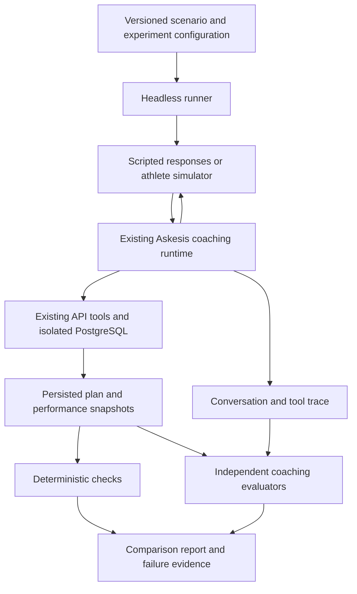

# Training-plan model benchmarks: proposal

Status: design reference, 2026-10-09. Repository inspected at `3fadfee28aa1f01561bd9f8e0c85f5148aede154`. The agreed local running proof of concept is implemented; see [running the benchmark](../operations/training-plan-benchmarks.md). The broader experiments, comparisons and hosted interfaces below remain proposals.

## Recommendation

Build a headless evaluation workflow around the existing coaching runtime and authoritative API tools. Give it versioned athlete scenarios, controlled model/prompt configurations, bounded conversations, saved plan snapshots and separate evaluators. Begin with a CLI and reviewable reports.

The central question is: **Can this configuration reliably discover what an athlete needs, save a useful plan, and adapt it when their circumstances change?** Model, prompt and reasoning settings are experimental variables; the tools, environment, scenarios and grading criteria are controlled variables.

The user's suggested architecture fits: a model can play the athlete, the real Askesis agent coaches them, and separate model calls assess the result. Deterministic checks should handle exact constraints. Model judges should handle coaching judgments that cannot be reduced to those checks.

## Agreed proof-of-concept scope and local execution

The first delivery is one hypothetical running situation, the current production coaching prompt/model, one athlete simulator and one reviewer. It produces the real persisted plan, conversation/tool evidence, deterministic checks and an overall assessment of acceptable, needs revision or incomplete. The scenario defines the required planning horizon. Additional sports, adaptation cases, multiple reviewers and model/prompt comparisons are follow-on work described below.

Run PostgreSQL, the real API, the coaching worker and the evaluation driver locally. The existing provider-backed model calls remain remote; local execution does not mean installing local models. The frontend is optional. Keep the current prompt/version unchanged for this first run; prompt-injection and compatibility refactors become necessary when introducing candidate prompts.

Use one dedicated local benchmark database, isolated from both production and ordinary development. A worktree-specific Compose project owns its PostgreSQL service and persistent named volume. Each evaluation run creates a fresh synthetic athlete and conversation in that database and records its run ID. Existing runs remain available for inspection without resetting the database. If comparison variants later require different migrations or conflicting process configuration, they can use separate environments.

Reuse the existing Compose PostgreSQL and Atlas migration setup, with benchmark-specific ports, environment and explicit loopback bindings. Do not invoke `dev:setup` or `dev:local` unchanged: they configure browser verification, start the frontend and default to simulated chat in a newly generated worktree. The benchmark wrapper must select real `agent` execution, use the benchmark database/API, start its own worker and check `/api/ready` plus worker readiness before submitting a message. Keep provider and development credentials in private ignored configuration; do not inherit a production database URL as a default. Only the API and operator fixture/export tasks receive database credentials.

The proof-of-concept command is:

```sh
pnpm bench run --scenario running-poc --keep-alive
```

Its responsibilities are to resolve isolated configuration, start PostgreSQL, apply migrations, start the API and worker, wait for readiness, seed the scenario, run the conversation, export the saved plan, execute checks/review and write a report. Reuse a healthy benchmark environment when its identity and configuration match; refuse an occupied port belonging to an unrelated service.

Show stage changes and observable activity while it runs: environment readiness, simulated athlete messages, coach replies, tool names/status, saved schedule batches, generation completion, review progress and the final verdict/report path. Persist run state as well as printing it, so interrupted execution can still be inspected. Keep credentials and private reasoning out of terminal/output artifacts. Inspection and regrading read saved artifacts without triggering further coaching.

After writing the report, `--keep-alive` keeps the API available and the CLI attached until Ctrl+C. Without that option, the wrapper shuts down application processes it started. Ctrl+C during generation cancels the active run through the existing lifecycle and retains accepted partial output; it must not silently resume or replay the model session on restart. Neither path removes the database volume or saved reports. A separate `bench stop` stops this benchmark environment, and an explicit scoped `bench reset` removes its database; neither may target another worktree's resources.

The database holds live application state; the exported run directory holds portable evaluation evidence and a readable Markdown report. Start with those files for viewing results. The running API is useful for service inspection, but synthetic athletes do not automatically appear in an existing browser account. Connecting a browser later requires normal development identity provisioning and authentication.

Retain environment configuration as a separate concern from scenario orchestration and grading. A later hosted environment can change how the API/database/worker are provisioned and where artifacts are stored while using the same scenarios, tools and assessment flow. No hosted scheduler or database fleet is needed for this proof of concept.

## What exists elsewhere

| Reference                                                                                                                                                          | What it establishes                                                                                                       | What to borrow                                                                                                               |
| ------------------------------------------------------------------------------------------------------------------------------------------------------------------ | ------------------------------------------------------------------------------------------------------------------------- | ---------------------------------------------------------------------------------------------------------------------------- |
| [PlanFitting](https://arxiv.org/abs/2309.12555)                                                                                                                    | A conversational exercise-planning research system evaluated with users, intrinsic checks and experts.                    | Assess elicitation, personal constraints and the resulting plan together.                                                    |
| [Exercise and health coaching evaluation review, JMIR](https://www.jmir.org/2025/1/e79217/)                                                                        | A review of 20 studies found heterogeneous evaluation methods and gaps in reliability and real-world validation.          | Treat a synthetic benchmark as comparative engineering evidence; separately validate actual athlete outcomes.                |
| [Sierra's tau-bench family](https://github.com/sierra-research/tau2-bench)                                                                                         | Simulated conversations with domain policies, tools and tasks; the current repository describes tau³-bench.               | Evaluate a real tool-using agent in an isolated domain environment. Pin task versions: fixes can change score comparability. |
| [Promptfoo simulated users](https://www.promptfoo.dev/docs/providers/simulated-user/) and [custom providers](https://www.promptfoo.dev/docs/providers/custom-api/) | Persona-driven multi-turn tests can wrap custom JavaScript/TypeScript targets.                                            | Investigate an adapter before implementing generic experiment/reporting infrastructure.                                      |
| [Anthropic's agent evaluation guidance](https://www.anthropic.com/engineering/demystifying-evals-for-ai-agents)                                                    | Combines deterministic, model and human grading, isolated trials, transcript inspection and regression/capability suites. | Grade outcomes, calibrate judges and keep failures explainable.                                                              |
| [Bloom](https://www.anthropic.com/research/bloom)                                                                                                                  | Generates targeted behavioral scenarios and evaluates rollouts.                                                           | Later generate cases for specific weaknesses, then review and freeze them before comparing candidates.                       |

These are relevant precedents, rather than evidence that an existing commercial endurance product publishes this exact benchmark. The research does not establish a standard, validated endurance-plan scoring system we can simply adopt.

[Official OpenAI evaluation guidance](https://developers.openai.com/api/docs/guides/evaluation-best-practices) also recommends task-specific cases, human calibration and comparisons against explicit criteria. Its current [deprecation notice](https://developers.openai.com/api/docs/deprecations) schedules the hosted Evals platform to become read-only on 31 October 2026 and shut down on 30 November 2026. Use portable scenario files and normal model calls; do not make that platform a dependency.

## Fit with this repository

- [`apps/agent/src/runtime.ts`](../../apps/agent/src/runtime.ts) already separates the model/tool loop from the browser. `SdkRuntime.execute` receives structured context, a claim and an API client. It also accepts a model override, currently used for scripted SDK tests.
- [`apps/agent/src/config.ts`](../../apps/agent/src/config.ts) configures the model and reasoning. The coaching prompt is currently imported directly from [`prompt.ts`](../../apps/agent/src/prompt.ts), rather than supplied per experiment.
- [`apps/agent/src/api.ts`](../../apps/agent/src/api.ts) routes tools through `/internal/agent/*`; [`agent.service.ts`](../../apps/api/src/modules/agent/agent.service.ts) owns authorization, receipts and mutations.
- [`agent.schemas.ts`](../../apps/api/src/modules/agent/agent.schemas.ts) supplies the production tool schemas. Its literal prompt version also participates in worker readiness, so changing an experiment's prompt identifier is not currently an independent operation.
- [`plan.validation.ts`](../../apps/api/src/modules/plans/plan.validation.ts) supplies structural checks. Those checks do not establish appropriate progression, useful workout selection or adherence to every athlete constraint.
- [`apps/api/test/db/agent.test.ts`](../../apps/api/test/db/agent.test.ts) demonstrates creating conversations and exercising claims/tools against the real domain services. [`live-smoke.ts`](../../apps/agent/src/live-smoke.ts) checks a real provider/tool round trip, without assessing coaching quality.

No dedicated plan-quality benchmark was found in the inspected workspace scripts, agent tests or documentation. This proposal complements the existing integration and runtime tests.

The important boundary to preserve is API ownership of plan state. Removing the frontend does not require replacing production tools with invented simulator responses or giving the coaching worker database credentials.

## Proposed flow



### Three complementary test modes

1. **Plan construction from a prepared brief.** Seed an agreed brief, calibration and conversation state, then ask the agent to construct a defined planning horizon. This isolates planning/tool capability from onboarding. It should start at the production-equivalent point after discovery, rather than alter the coach's normal opening-exchange behavior.
2. **Conversation to plan.** Start with incomplete information and answer the coach's questions. This tests whether it discovers relevant facts, manages unknowns, avoids unnecessary questions and actually produces the plan.
3. **Plan adaptation.** Begin with a saved plan and introduce a specified change, such as losing Thursday availability or changing an event date. Save snapshots before and after each checkpoint. This tests appropriate revisions and preservation of unrelated content.

Report these separately. A strong conversational model can still be poor at plan construction, and a strong planner can still require too much effort from the athlete.

## Scenarios and simulated athletes

Each scenario contains a synthetic athlete's facts, initial database state, opening message, disclosure policy, optional change events, permitted negotiation and success criteria. A persona is useful when it changes the task: training history, availability, equipment, preferences or willingness to answer questions matter more than decorative biography.

Keep three information sets distinct:

- **Coach-visible:** actual messages, current brief, performance and normal tool results.
- **Simulator-private:** the full persona, facts available when asked, behavioral instructions and scheduled disclosures.
- **Evaluator-private:** expected outcomes, assertions and grading anchors.

The simulator must not see the scoring rubric. The coach must not receive private facts through test variables or system messages. Judges receive an explicit ledger of what the coach knew at each checkpoint: do not punish it for failing to use undisclosed information; separately assess whether it asked for information it should have discovered.

Illustrative authoring format, independent of the eventual schema:

```yaml
id: half-marathon-three-days
version: 1
mode: conversation
clock: 2027-01-04T12:00:00Z
timezone: Europe/London
openingMessage: "I'd like help preparing for my first half marathon."
athleteFacts:
  eventDate: 2027-03-28
  currentRunsPerWeek: 3
  currentWeeklyDistanceMetres: 22000
  longestRecentRunMetres: 9000
  availableDays: [Tuesday, Thursday, Sunday]
  recentPerformance:
    distanceMetres: 5000
    durationSeconds: 1680
    observedOn: 2026-12-20
disclosure:
  policy: answer_requested_facts
  unknownFactResponse: "I don't know."
checkpoints:
  - when: initial_plan_saved
    userMessage: 'I can no longer train on Thursdays. Use Tuesday, Saturday and Sunday.'
expectations:
  initialPlanningHorizonWeeks: 4
  respectAvailableDays: true
  preserveUnaffectedContent: true
limits:
  maxAthleteMessages: 18
```

This is an example of test inputs, not a training recommendation. Context-sensitive quality expectations need coach review before becoming authoritative criteria.

Support two ways to drive conversations:

- **Controlled responses:** deterministic fact lookup or explicit conversation checkpoints. Start with prepared-brief tests and a few controlled branches. A rigid prerecorded transcript can answer the wrong question when candidates behave differently, so do not indiscriminately replay it.
- **LLM simulator:** a frozen simulator model and prompt respond naturally while adhering to the fact sheet. It should be an ordinary athlete, not a second coach helping the candidate produce a better answer.

For the simulator, keep facts structured and track which were disclosed. Where possible, let the model select fact IDs and a response intent, with code enforcing permissible values. Audit the final wording for invention or leakage. A simulator error invalidates a trial; it does not become a coaching failure. Retain and report invalid trials instead of silently dropping them or retrying until they pass.

Use explicit runner checkpoints and stop reasons. A persisted plan with completed agreed coverage can end a creation stage; adaptation scenarios continue through their specified events. Other valid endings include an appropriate explanation that a request cannot be satisfied. Turn limits, provider failures, harness failures and voluntary simulator stops remain distinct. A simulator saying it is satisfied is not sufficient proof of success.

## Environment and minimum abstraction

Use the existing `SdkRuntime`, `Worker` lifecycle and API tool handlers. First introduce injectable prompt text/identity, model configuration and an observation hook, with current production behavior as the default. Capture observable model messages, tool requests/results and usage; no private reasoning is required.

Separate prompt provenance from tool-contract compatibility. Today `PROMPT_VERSION` is duplicated in worker/API configuration and used as a readiness/schema gate. Experiments need honest prompt IDs and hashes while still verifying compatible tools. Resolve that narrowly before running prompt variants; do not label candidate runs as the unchanged production prompt.

An operator-only benchmark driver can create synthetic athletes and submit messages through the same service functions used by database tests. The worker still uses authenticated internal routes and run credentials. This needs no browser or live Clerk account per persona and adds no public authentication bypass. Public Clerk middleware and production ownership checks remain intact.

Use a dedicated disposable benchmark Compose project/database with migrations applied, and a fresh athlete/conversation per trial. A single sequential trial at a time is sufficient initially. Each comparison variant starts from identical fixture state; no baseline plans, calibrations or conversation history carry into the candidate trial. Fixture setup and export are operator responsibilities, not coach tools. Human confirmation/locking remains outside coach permissions; draft creation is the normal benchmark endpoint.

The scenario's date must be authoritative in context, calibration reads/writes and date-sensitive validation. Performance services already accept a `now` argument in several places, but agent handlers currently use the default clock. Thread a scenario clock through those domain operations; keep lease heartbeats and execution deadlines on real elapsed time. Merely rewriting `performance.today` in the prompt would leave inconsistent behavior.

Initially keep production history truncation, batching, tool errors and limits. They affect whether a model can create plans in Askesis. Later experiments can vary them explicitly, with their own recorded configuration.

Start comparisons with models supported by the current OpenAI runtime. Comparing Claude, Gemini or other providers needs a compatible model adapter; changing `AGENT_MODEL` alone does not supply that support. Use the existing SDK model-override seam where suitable, and verify tool-call/schema handling, streaming, cancellation, usage reporting and supported reasoning settings before scoring. Unsupported settings should fail configuration or be explicitly omitted and reported. The resulting benchmark compares model-plus-Askesis-runtime configurations, not an intrinsic universal ranking of models.

## What to grade

### Exact checks in code

Read the persisted aggregate and athlete performance after execution, including complete workout trees, completions, targets and prescribed coverage. Reuse existing validators and canonical projections; add scenario assertions where application validation is insufficient.

Examples:

- A plan was actually saved when expected; its brief, dates and trained sports match disclosed requirements.
- No workout occurs on explicitly unavailable days; the application policy of at most two sessions per day is respected.
- Prescription trees and targets resolve correctly, with provenance preserved for measured evidence versus estimates.
- The agreed planning horizon is completely covered, including intentional rest days. A twelve-week plan with four agreed prescribed weeks can pass; requiring twelve weeks would contradict current product behavior.
- Changes outside an explicitly bounded revision remain semantically unchanged. Normalize generated IDs and use the canonical plan representation for comparisons.
- Zone-only recalibration does not rewrite the schedule, consistent with athlete-owned performance.
- A conversation that only asks about training does not create an unwanted plan.

The validator can return review warnings rather than errors. Classify findings explicitly: an unconfirmed brief is expected for an agent-created draft; a missing required prescription is a different issue. Do not equate every lock-preview warning with poor coaching.

Derived metrics should respect units and uncertainty: report running/swimming distance and cycling duration separately, expand repeat trees, and retain unknown duration/load when it cannot be computed. Do not add sport distances into a supposed total training load or convert every zone to a precise physiological prediction.

### Two focused model evaluators

**Plan-quality evaluator:** judges appropriate progression from the disclosed baseline, goal specificity, recovery and hard-session placement, realism within the athlete's constraints, and practical prescription completeness. It receives the saved plan, calibration, computed summaries, known facts and a versioned rubric. It should not need persuasive coaching prose to establish that a good plan exists.

**Conversation/adaptation evaluator:** judges focused discovery, handling of missing/unknown information, material assumptions, explanations, response to changed constraints and consistency between promises and saved changes. It receives the transcript, knowledge ledger, tool evidence and checkpoint snapshots.

Use structured findings: criterion ID, pass/fail/uncertain/not-applicable, severity, short explanation and evidence references to actual messages or workouts. Small anchored ordinal scores can supplement those findings; avoid unexplained “8/10” ratings. Alternative training methodologies can pass if appropriate for the scenario. Do not turn a preferred template or a universal weekly percentage increase into ground truth.

Evaluate independently before any comparison. Hide candidate model/provider/prompt labels, standardize plan presentation and treat plan/transcript content as untrusted data. For close baseline/candidate comparisons, add blinded pairwise judgments with randomized order and ties permitted. Two judge calls may use the same model initially; that is two rubric perspectives, not two independent expert opinions. Audit with another model family and human reviewers as the suite grows. Preserve disagreements rather than averaging away serious findings.

### Calibrate the evaluators themselves

Before scores influence model choices, assemble a small coach-reviewed collection of acceptable plans, plausible alternative plans and deliberately broken examples. Include unavailable-day violations, false calibration provenance, misleading completion claims, empty prescriptions and poor recovery placement. Check whether each grader distinguishes the intended defects and explains them accurately.

Review all pilot transcripts/grades with the owner and, for training-quality criteria, an experienced coach. Record judge-versus-human agreement and false positives/negatives by criterion; add anchors where they disagree. Deterministic safety/constraint failures cannot be canceled out by prose quality. Judge-identified severe concerns require review while calibration is provisional.

## Experiments and reports

Every trial records the repository revision, migrations/tool schemas, prompt text/hash, model ID and available snapshot identifier, reasoning/sampling settings, scenario version/hash, clock, fixture hash, simulator configuration, evaluator/rubric versions, limits and stop reason. Hosted-model nondeterminism remains even with fixed inputs; record seeds where supported without claiming exact replay.

Start by changing one variable: same model with two prompt variants, then two models with the same prompt and supported settings. A later model-by-prompt matrix can reveal interactions. Freeze simulator/judges across a comparison. If those change, regrade saved plans or rerun the relevant baseline and label the new benchmark version.

Repeat scenarios and compare paired results by scenario, reporting uncertainty and results by sport/task category. Three repeats can expose instability but provide weak statistical evidence; use the pilot to estimate variance before choosing a meaningful larger sample. A configuration that occasionally creates an excellent plan differs from one that usually creates a good plan. Report success frequency, variation and how often each case passes every repeat; do not select the best run as the headline.

Keep a development suite for prompt iteration and a separate held-out suite for decisions. Promote observed failures into reviewed regression cases. Any AI-generated new scenarios are reviewed/frozen before both candidates run against them.

Save portable artifacts outside committed source by default:

```text
benchmark-results/<experiment>/<scenario>/<trial>/
  manifest.json
  conversation.json
  tool-trace.jsonl
  plan-before.json
  plan-after.json
  performance.json
  checks.json
  judgments.json
  metrics.json
```

Aggregate reports should show completed/failed/invalid/inconclusive counts, scenario success, hard failures, quality dimensions, adaptation regressions, judge disagreements, athlete messages needed, tool-error recovery, elapsed time and token/cost usage. Include failure drilldowns with the actual plan and message evidence. Keep quality, constraints and efficiency visible separately before considering an overall score.

Separate coach generation costs from simulator and evaluator costs. Existing completed runs report input/output tokens, but monetary costs are not calculated and failed executions may lack complete usage. Estimate only from known usage and a dated price table, marking missing usage as unknown. Add explicit experiment call/token limits and a spend estimate; per-request output limits are not total-budget enforcement.

Allow regrading saved artifacts without regenerating plans. Do not automatically rerun interrupted model sessions: retries of idempotent tool delivery differ from new model trials. Credential headers, claim tokens, keys and login links must not appear in exported evidence.

## Build versus adopt

My recommendation is an Askesis-owned scenario/environment adapter with an adoption spike for Promptfoo's experiment shell. Its TypeScript custom providers and simulated-user support are a good fit, but its documented defaults require deliberate integration: hidden test variables can reach custom providers, the simulator sends chat-format histories, and simulated-user generation is hosted by default.

The spike must prove unique trial state, correct conversation delta handling, no duplicate message submission, private-fact isolation, saved-state grading, explicit simulator/judge versions and useful artifact export. Pass only an opaque trial identifier into the target adapter; never forward the complete persona/rubric as coach input. Configure model access and storage explicitly.

If those requirements fit cleanly, reuse Promptfoo for matrices/reports. If they require substantial workarounds, a small TypeScript runner is the better first delivery. In either case, keep scenario schemas, domain checks and artifacts independent of the shell. Bloom is a later scenario-discovery option, not the first orchestration dependency.

## Delivery sequence and exit criteria

Deliver the single-running-scenario local proof of concept above first. The following stages describe the expansion into a comparative benchmark once that flow is inspectable end to end.

| Stage                             | Deliverable                                                                                                      | Exit criterion                                                                                                                                         |
| --------------------------------- | ---------------------------------------------------------------------------------------------------------------- | ------------------------------------------------------------------------------------------------------------------------------------------------------ |
| 1. Agree the evaluation contract  | Six scenarios, visible/private boundaries, initial rubrics and coach-reviewed examples.                          | We can explain why each acceptable/broken example passes or fails; production partial horizons and review rules are represented correctly.             |
| 2. Headless baseline              | Isolated environment, runtime configuration seam, authenticated tools, saved artifacts and deterministic checks. | The current coach creates a real persisted plan without the frontend. Scripted runtime cases prove snapshots, stop reasons and failure classification. |
| 3. Conversation and grading pilot | Controlled conversations, bounded LLM simulator, two focused evaluators and manual review.                       | All six cases can be inspected end to end; simulator errors and judge disagreements are visible; deliberate defects are detected.                      |
| 4. First comparison               | Current prompt versus one candidate prompt on the same model, followed by a same-prompt model comparison.        | Paired reports include repeats, costs/unknowns and concrete regression evidence. Results guide a specific decision rather than merely rank outputs.    |
| 5. Broaden and automate           | Roughly 20–30 reviewed scenarios, held-out cases, second judge-family audit and scheduled/on-demand runs.        | A prompt/model change can be evaluated with a reproducible command and reviewed report; calibrated regression criteria govern any later CI gate.       |

Suggested first six cases: a fully specified running brief; an incomplete first-half-marathon conversation; a cycling athlete without power-meter access; a triathlon with constrained pool days; Hyrox plus strength prescriptions; and a bounded revision of an existing plan. Add unsupported/impossible requests, close A races, unknown fitness, changed calibration, unit/timezone boundaries and general discussion without creation intent as the suite expands.

After the proof of concept, run six baseline trials and inspect them. After grading calibration, six scenarios × two prompt configurations × three repeats yields 36 conversations, before accounting for simulator and grading calls. Bound that expanded pilot using measured generation costs rather than assuming a price or promising statistical significance.

A likely code layout is a small `apps/evals` workspace package plus checked-in scenario/rubric files, with narrow side-effect-free exports from the existing agent/API packages where needed. Resolve package build/import boundaries during Stage 2; do not extract an entire new domain architecture merely to support a test runner. The alternative shell does not change these contracts.

Proposed operator experience, not existing commands:

```sh
pnpm bench run --suite pilot --experiment prompt-comparison --repeats 3
pnpm bench compare --baseline <run-id> --candidate <run-id>
pnpm bench grade --run <run-id> --rubric <version>
```

## Decisions to refine together

The immediate scope is the one-running-scenario local proof of concept. Define its required horizon and review criteria before implementation; four prescribed weeks within a twelve-week goal is a useful initial example. Later expand to all supported sports, longer horizons, repeated comparisons and additional evaluator perspectives, with owner/coach review before automated quality gates. The highest-value discussion is what a useful plan means here: acceptable training methodologies, negotiation of unrealistic goals, and which failures should block a model/prompt change.

This workflow can measure comparative planning behavior and product-contract compliance. Demonstrating adherence, injury outcomes or improved race performance requires longitudinal real-user evidence beyond these synthetic trials.
